# Auth, Authorization & Session Lifecycle — Vanilla JS

A 26-slide, single-file HTML lecture (in Georgian) about authentication in plain JavaScript, with no framework. It covers JWT, access and refresh tokens, a `fetch` wrapper that attaches the token, silent refresh with one shared Promise, a small auth store with `subscribe()`, a hand-written route guard and RBAC. Animated diagrams explain how things work step by step, and several slides have live demos you can click through with the audience.

This is the framework-free version of the Angular auth lecture. The design and the order of the slides are the same. The code and the framework-specific explanations are rewritten for vanilla JS.

**▶ Live deck: [thothcher.github.io/js-auth](https://thothcher.github.io/js-auth/)**

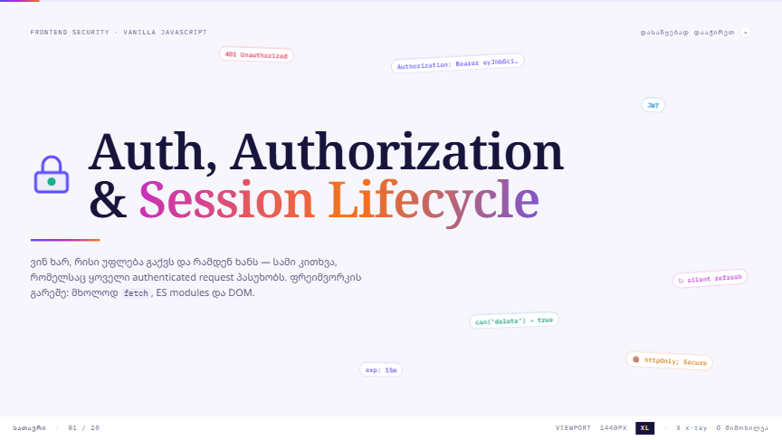

---

## Quick start

1. Open the live deck at **[thothcher.github.io/js-auth](https://thothcher.github.io/js-auth/)**, or open [index.html](index.html) locally in a modern browser (Chrome, Edge, Firefox or Safari).
2. Press **F** for fullscreen and **→** to begin.

There is no build step. Tailwind v4 and the fonts load from CDNs, so the machine needs internet the first time. After that the browser cache is usually enough.

> Tip: the slide number is stored in the URL (`…/index.html#11`), so you can reload or share a link to any slide.

## Keyboard

| Key | Action |
|---|---|
| `→` `Space` `PageDown` | next slide |
| `←` `PageUp` | previous slide |
| `Home` / `End` | first / last slide |
| `O` | overview of all slides |
| `N` | speaker notes for the current slide |
| `X` | x-ray: hover to read an element's Tailwind classes |
| `F` | fullscreen |
| `?` | help panel |
| `Esc` | close overlays |

## What's on each slide

| # | Topic | Animation / interaction |
|---|---|---|
| 01 | Title | the lock opens and snaps shut; token "chips" float around |
| 02 | Agenda | six links of one chain light up in turn |
| 03 | HTTP has no memory | two requests: the server recognises the first (token), not the second |
| 04 | Auth schemes | how every request proves who you are: stateful (session cookie → DB lookup) vs stateless (Bearer → signature check), animated; Session, JWT, OAuth 2.0, OpenID Connect, API key, mTLS and Basic compared by header, use today and status |
| 05 | Encoding vs encryption | **toggle**: a login request crosses public Wi-Fi; over HTTP the person in the middle runs `atob()` on the Basic header and reads the password, over HTTPS they only get TLS noise; encoding, encryption, hashing and signing side by side |
| 06 | Opaque token vs JWT | **step-through** with a next button: one server knows an opaque Bearer token ✓, three servers behind a load balancer don't ✕; then a JWT appears, splits into header · payload · signature, and all three servers verify it with the same key ✓ |
| 07 | HTTP vs HTTPS | port, encryption, integrity, server identity, cookies/HSTS and HTTP/2·3 compared; below, packets pass a scanner lens and a button switches between what the middle sees over HTTP (URL, cookie, password) and over HTTPS (IP, SNI, size) |
| 08 | HTTP status codes | 2xx · 3xx · 4xx · 5xx side by side, with 1xx and the `res.ok` trap underneath; 401 and 403 are tagged as the auth codes |
| 09 | Authn vs Authz | ID card scan ✓ · a keycard opens one door and is refused at the other · flip card quiz |
| 10 | JWT anatomy | header → payload → signature highlight in turn (click a part to pin it) |
| 11 | Access vs Refresh | timeline: access renews every 15 min ↻, refresh expires → logout |
| 12 | Token lifecycle | sequence diagram in sync with the six steps (click any step) |
| 13 | Where to store tokens | an XSS bug raids all four storages; httpOnly cookie shields |
| 14 | `fetch` wrapper | a plain request goes through `authFetch()` and comes out with `Authorization: Bearer` |
| 15 | Idle session | **live demo**: a 15 s countdown, warning phase and lock-out overlay |
| 16 | Silent refresh | **toggle**: 4 × `/refresh` race with no lock vs one shared `refreshPromise` |
| 17 | Auth state | `setUser()` → store → getters → UI badge, then `logout()` |
| 18 | Route guards | the guard sends a guest to `/login?returnUrl=…`, then lets them into `/admin` |
| 19 | RBAC matrix | permission cells cascade in; the same matrix as `PERMISSIONS` + `can()` |
| 20 | Permission engine | **live demo**: switch roles; the buttons pop or shake as permissions change |
| 21 | `data-permission` | the button is hidden, but `curl` still reaches the API → the server answers 403 |
| 22 | Big picture | a request lights up every stage of the chain |
| 23 | Common mistakes | the mistake cards appear one after another |
| 24 | Summary | gradient key phrases |
| 25 | Auth flow | **live demo**: a five-sided 3D "cube" turns left through login, register, 6-digit code, recover and new-password forms, each with live validation; the login request → response → token storage animates step by step; 8 REST endpoints, with the current form's endpoint lit |
| 26 | Thank you / Q&A | near-black slide with a black-and-white padlock photo and drifting chips |

## The code on the slides

All snippets belong to one small set of ES modules, so the names match from slide to slide:

| Module | What it holds | Slides |
|---|---|---|
| `auth.js` | the current user and access token, `subscribe()`, `setUser()`, `logout()`, `can()` | 17, 19 |
| `api.js` | `authFetch()` attaches the Bearer header; `apiFetch()` handles 401 → refresh → retry | 14, 16 |
| `guards.js` · `router.js` | `authGuard`, `roleGuard`, and `navigate()`, which follows redirects | 18 |
| `permissions.js` | `applyPermissions()` hides every `[data-permission]` element the user may not use | 21 |

## Animated explainers

**Authn vs Authz** (slide 9): the ID card is verified, and the keycard opens one door but not the other.

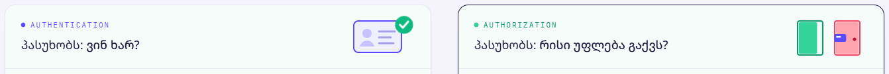

| | |
|---|---|
| **HTTP is stateless** (slide 3)<br>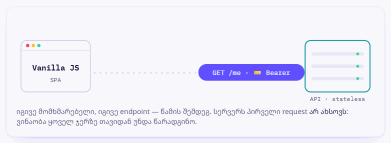 | **Token lifetimes** (slide 11)<br>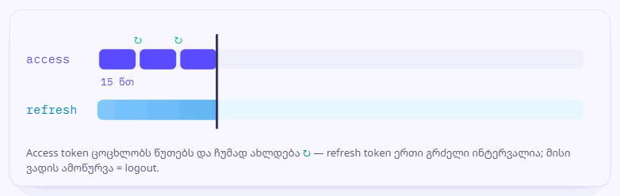 |
| **XSS vs storage** (slide 13)<br>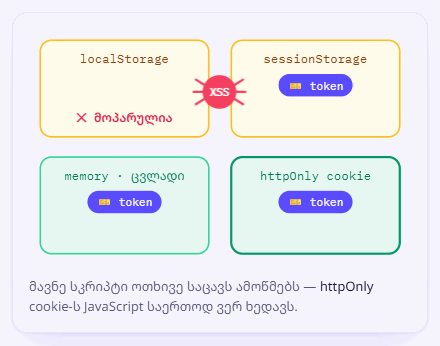 | **Auth store** (slide 17)<br>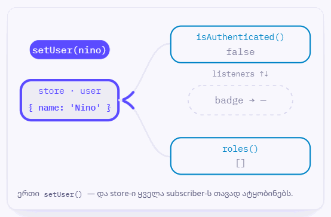 |
| **Silent refresh race** (slide 16)<br>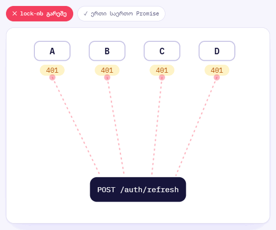 | **Route guard** (slide 18)<br>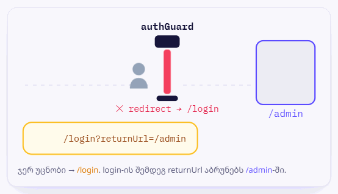 |
| **fetch wrapper** (slide 14)<br>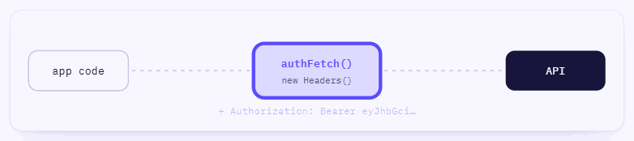 | **Hiding ≠ security** (slide 21)<br>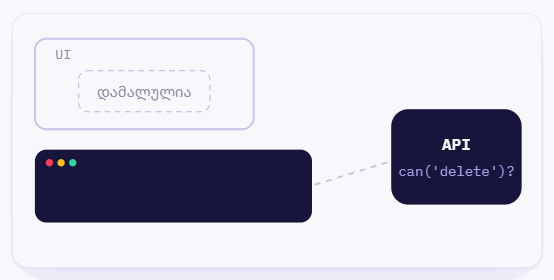 |

**Token lifecycle, step by step** (slide 12): the sequence diagram and the list advance together.

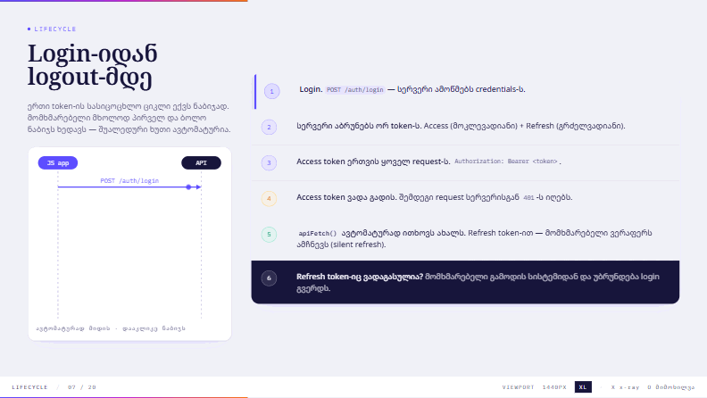

## How it's built

- **One file.** All markup, CSS and JS live in `index.html`. The diagrams are inline SVG animated with CSS `@keyframes`, so they stay sharp on any projector and need no image files.
- **Palette.** The colour tokens are at the top of the file, in the `@theme` block (`--color-live` blue, `--color-flame` tangerine accent, `--color-box-p`, and so on). Change them there and every slide follows.
- **Background.** One solid colour, set on `body` in the hand-written `<style>` block. There are no gradients or patterns behind the slides.
- **Diagrams.** Each diagram's CSS sits in the `/* ── ანიმირებული დიაგრამები ── */` block, labelled with its slide number (`/* 13 · XSS … */`).
- **Players.** Animations that should run only while their slide is visible register in `players` with `play()` and `stop()`. Examples are the step-by-step sequence diagram, the silent-refresh toggle, the JWT highlight cycle and the idle-session countdown.
- **Accessibility.** Slide transitions and all loops turn off when the OS asks for reduced motion (`prefers-reduced-motion`).

## Regenerating the GIFs

The GIFs in [docs/](docs/) are recorded from the real deck in headless Chrome:

```bash
cd tools
npm install puppeteer-core gifenc pngjs
node record-gifs.js               # every GIF + deck tour + cover.png
node record-gifs.js auth-store    # just one
```

If Chrome is installed somewhere else, set `CHROME=/path/to/chrome`.

## Files

```
auth-js/
├── index.html             the whole presentation
├── README.md
├── sitemap.xml            one-page sitemap for search engines
├── docs/                  GIFs and the cover image used above
├── img/storyset/          illustrations from Storyset, recoloured to the accent
└── tools/record-gifs.js   records docs/*.gif from the deck
```

## Credits

- Illustrations: [Storyset](https://storyset.com/) (Amico style), recoloured from purple to the deck's tangerine accent `#ff6b35`. Free use requires this credit; it is also on the last slide.
- Last-slide photo: [Patrick Szalewicz](https://unsplash.com/@fachinformatiker) on [Unsplash](https://unsplash.com/photos/Hk-C576NPfk).
